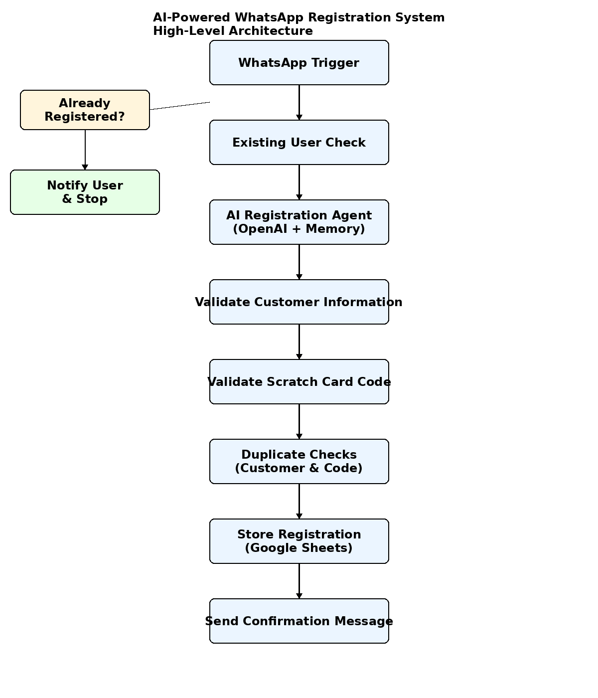

# 🤖 AI-Powered WhatsApp Scratch Card Registration System

An intelligent customer registration workflow built using **n8n**, **OpenAI**, **WhatsApp Cloud API**, and **Google Sheets**.

This workflow automates the complete customer registration process for a promotional scratch card campaign by validating customer information, checking registration eligibility, verifying scratch card codes, and storing successful registrations automatically.

---

## 📌 Features

- WhatsApp Cloud API integration
- AI-powered conversational data collection
- Automatic extraction of customer details
- Intelligent validation of user messages
- Scratch card code verification
- Duplicate registration prevention
- 15-day registration lock mechanism
- Google Sheets database integration
- Automatic confirmation messages
- Invalid input handling
- Invalid scratch card detection
- Already registered detection
- Conversation memory using AI

---

## 🛠️ Tech Stack

- n8n
- OpenAI GPT-4.1
- WhatsApp Cloud API
- Google Sheets
- JavaScript
- LangChain Memory

---

## 🏗️ System Architecture

## 🔄 Workflow Overview

1. Customer sends a WhatsApp message.

2. The workflow determines whether the customer is starting a new registration or continuing an existing conversation.

3. The AI Agent collects:

- Full Name
- State & City
- Scratch Card Code

4. The workflow validates:

- Message relevance
- Customer details
- Scratch card format
- Required fields

5. Business rules are applied:

- Duplicate customer detection
- 15-day registration restriction
- Scratch card validity
- Scratch card reuse detection

6. Valid registrations are stored in Google Sheets.

7. A confirmation message is automatically sent to the customer.

---

## 🧠 AI Capabilities

The AI agent maintains conversation context and progressively collects customer information without asking users to resend previously provided details.

It can:

- Remember previous messages
- Validate structured information
- Detect missing fields
- Generate contextual replies
- Handle incomplete conversations
- Guide users until registration is complete

---

## ✅ Validation Rules

### Customer Validation

- Full Name required
- State & City required
- Scratch Card Code required

### Scratch Card Validation

- Exactly 8 characters
- Alphanumeric only
- Must contain at least one letter
- Must contain at least one number

### Duplicate Protection

- Prevents duplicate customer registrations
- Prevents reused scratch card codes
- Restricts repeat registration within a configurable time window

---

## 📂 Integrations

- WhatsApp Cloud API
- OpenAI GPT
- Google Sheets

---

## 📸 Workflow

## 🔒 Security

Sensitive information such as API credentials, authentication tokens, and production configuration has been removed before publishing.

---

## 🚀 Possible Improvements

- Database integration (PostgreSQL / MySQL)
- Dashboard for campaign analytics
- Email notifications
- Admin portal
- Rate limiting
- Audit logging
- Multi-language support
- QR code registration
- Cloud database instead of Google Sheets

---

## 📄 License

This project is published for educational and portfolio purposes.

